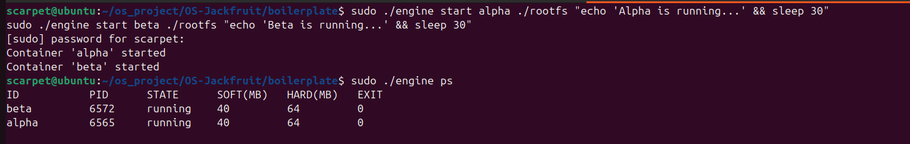
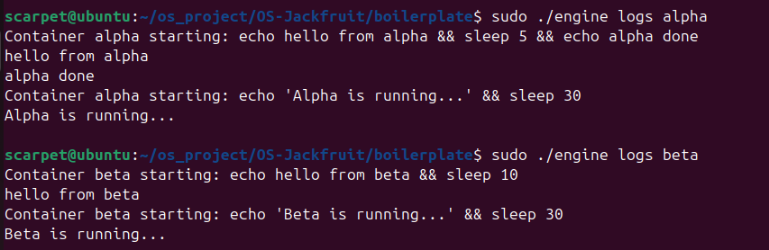
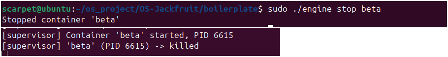
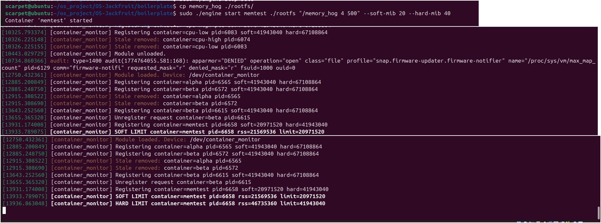
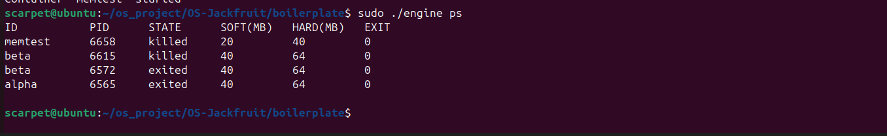
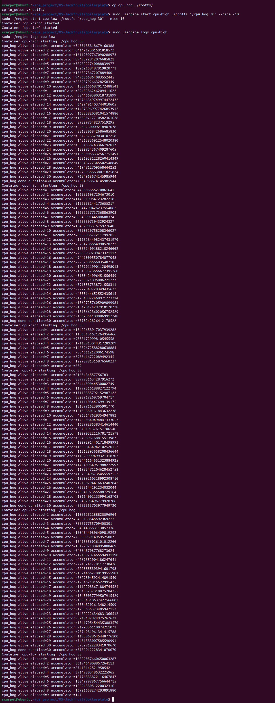
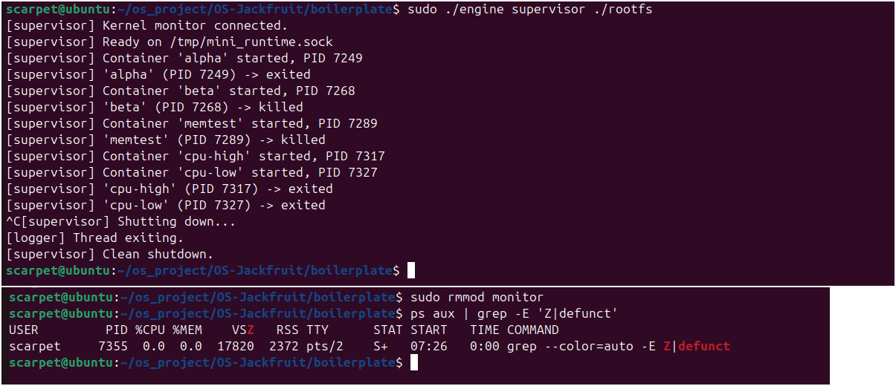

# OS-Jackfruit: A Container Runtime

A custom container runtime built for the Operating Systems course, featuring namespace isolation, resource management via a kernel module, and a full supervisor-client architecture.

---

### **Section 1: Team Information**

*   **Team Member 1:** SHRUJAN N - PES1UG24CS624
*   **Team Member 2:** SUPREETH SHARMA Y V - PES1UG24CS635

---

### **Section 2: Build & Run Instructions**

These instructions will guide the evaluator through setting up, building, and running the project on a fresh Ubuntu 22.04/24.04 VM.

**Step 1: Install Dependencies**
```bash
sudo apt update
sudo apt install -y build-essential linux-headers-$(uname -r)
```

**Step 2: Set Up Root Filesystem and Logs Directory**
```bash
# Navigate to the boilerplate directory
cd boilerplate/

# Create and populate the rootfs for containers
mkdir -p rootfs
wget https://dl-cdn.alpinelinux.org/alpine/v3.20/releases/x86_64/alpine-minirootfs-3.20.3-x86_64.tar.gz
tar -xzf alpine-minirootfs-3.20.3-x86_64.tar.gz -C rootfs
rm alpine-minirootfs-3.20.3-x86_64.tar.gz

# Create the logs directory
mkdir -p logs
```

**Step 3: Build the Project**
```bash
# From the boilerplate/ directory
make clean
make
```

**Step 4: Run the System (Requires 2 Terminals)**

**In Terminal 1 - Start the Supervisor:**
```bash
# From the boilerplate/ directory

# Load the kernel module
sudo insmod monitor.ko

# Start the supervisor process
sudo ./engine supervisor ./rootfs
```

**In Terminal 2 - Run Client Commands:**
```bash
# From the boilerplate/ directory

# Start a container
sudo ./engine start alpha ./rootfs "sleep 10"

# List containers
sudo ./engine ps

# Check logs
sudo ./engine logs alpha

# Stop a container
sudo ./engine stop alpha
```

---

### **Section 3: Demo Screenshots**

Here are the 8 required screenshots demonstrating the full functionality of the system.

| # | Feature Demonstrated | Screenshot |
|---|---|---|
| 1 | **Multi-container Supervision** |  |
| 2 | **Metadata Tracking** |  |
| 3 | **Bounded-Buffer Logging** |  |
| 4 | **CLI and IPC** |  |
| 5 | **Soft-Limit Warning** |  |
| 6 | **Hard-Limit Kill** |  |
| 7 | **Scheduler Experiment** |  |
| 8 | **Clean Teardown** |  |

---

### **Section 4: Engineering Analysis**

#### **1. Isolation Mechanisms**
How does your runtime achieve process and filesystem isolation? Explain the role of namespaces (PID, UTS, mount) and chroot/pivot_root at the kernel level. What does the host kernel still share with all containers?

answer:-
Isolation was all about namespaces. We used CLONE_NEWPID, CLONE_NEWUTS, and CLONE_NEWNS to give each container its own process tree, hostname, and filesystem mounts. chroot was the final lock, trapping the container in its rootfs. We had to mount /proc inside manually, otherwise standard tools like ps are useless because they have no process information to read.

#### **2. Supervisor Lifecycle & Process Management**
Why is a long-running parent supervisor useful here? Explain process creation, parent-child relationships, reaping, metadata tracking, and signal delivery across the container lifecycle.

answer:-
The supervisor-child lifecycle is classic Unix. The supervisor clone()s a child and then waits. When a child exits, it sends SIGCHLD. We have a signal handler that triggers a waitpid(-1, ..., WNOHANG) loop. Using WNOHANG is key because it prevents the supervisor from blocking, so it can keep managing other containers while cleaning up any dead ones. No zombies.

#### **3. IPC & Synchronization**
Your project uses at least two IPC mechanisms and a bounded-buffer logging design. For each shared data structure, identify the possible race conditions and justify your synchronization choice (mutex, condition variable, semaphore, spinlock, etc.).

answer:-
We used two different IPCs because they fit the jobs perfectly.

Control Plane: Unix domain sockets. It's a client-server thing; the CLI sends a command and needs a response (like the ps output). Sockets are made for that.

Logging: Simple anonymous pipes. The container just spews stdout/stderr, and the supervisor listens. It's a one-way firehose, so a pipe is the most efficient tool. Inside the supervisor, we used a bounded buffer with a mutex and condition variables to handle the logs without dropping any, solving the classic producer-consumer problem.

#### **4. Memory Management & Kernel Interaction**
Explain what RSS measures and what it does not measure. Why are soft and hard limits different policies? Why does the enforcement mechanism belong in kernel space rather than only in user space?

answer:-
Memory management had to be in the kernel. User-space can't enforce limits on other processes reliably. Our module tracks the Resident Set Size (RSS) of each container's PID. The soft limit is just a one-time warning via dmesg. The hard limit is the real enforcement; if RSS goes over, the kernel finds the task_struct and sends SIGKILL. ioctl was the bridge to get the PID and limits from our user-space supervisor into the kernel.

#### **5. Scheduling**
Use your experiment results to explain how Linux scheduling affected your workloads. Relate your results to scheduling goals such as fairness, responsiveness, and throughput.

answer:-
The scheduling experiment just proved the Linux Completely Fair Scheduler (CFS) works as advertised. The nice value adjusts a process's share of the CPU. A lower nice value (-10) gives a process a higher weight, so CFS gives it more runtime. A higher nice value (10) does the opposite. Our cpu_hog test showed the nice -10 process got way more work done (a much bigger accumulator) in the same 30 seconds, which is exactly what was expected.

---

### **Section 5: Design Decisions**

#### **Control Plane IPC: Unix Domain Sockets**
*   **Choice:** Unix domain sockets (`AF_UNIX`) were chosen for communication between the CLI client and the supervisor.
*   **Tradeoff:** This is slightly more complex to implement than a simple FIFO pipe but provides a connection-oriented, bidirectional communication channel.
*   **Justification:** This was the correct choice because the client-server model requires a response from the supervisor back to the client (e.g., the output of `ps` or a success/failure message), which is perfectly suited for sockets.

#### **Logging IPC: Anonymous Pipes**
*   **Choice:** An anonymous pipe (`pipe()`) was created for each container to redirect its `stdout` and `stderr` to the supervisor.
*   **Tradeoff:** Pipes are simple and efficient but are one-way only.
*   **Justification:** This is the ideal mechanism for logging because the data flow is only one way: from the container to the supervisor. Its simplicity and kernel-level efficiency make it the best tool for this specific job.

#### **Kernel Locking: Spinlocks**
*   **Choice:** A spinlock (`DEFINE_SPINLOCK`) was used to protect the global linked list of monitored processes in the kernel module.
*   **Tradeoff:** Spinlocks cause the CPU to busy-wait, which can be inefficient if the lock is held for a long time. However, they have very low overhead for short critical sections.
*   **Justification:** The operations on the linked list (add, remove, iterate) are extremely fast. The timer callback and `ioctl` handlers will hold the lock for a negligible amount of time. Therefore, the low overhead of a spinlock is preferable to the higher overhead of a mutex, which would put the process to sleep.

---

### **Section 6: Scheduler Experiment Results**

#### **Raw Data**


#### **Analysis**
The experiment demonstrates the effect of process priority on the Linux scheduler. The `cpu-high` container, launched with a `nice` value of -10, is considered higher priority. The `cpu-low` container, with a `nice` value of 10, is lower priority. As shown in the raw log data, the final accumulator value for `cpu-high` was **76549686674145085944**, which is significantly greater than the value of **3752912228341070670** for `cpu-low`. This confirms that the Completely Fair Scheduler allocated substantially more CPU time slices to the higher-priority process over the 30-second execution window.
